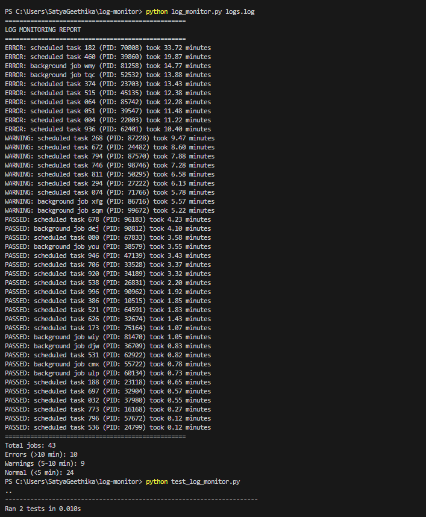

# Simple Log Monitor

A basic Python script that monitors job execution times from CSV log files.

## Features
- Parse CSV log files
- Track job start/end times
- Report warnings (5+ minutes) and errors (10+ minutes)

## Usage

```bash
# Run the monitor
python log_monitor.py logs.log

# Run tests
python test_log_monitor.py
```

## Log Format
```
HH:MM:SS,job name,START/END,PID
```

Example:
```
11:35:23,scheduled task 032, START,37980
11:35:56,scheduled task 032, END,37980
```

## Output
```
==================================================
LOG MONITORING REPORT
==================================================
ERROR: scheduled task 182 (PID: 70808) took 33.72 minutes
ERROR: scheduled task 374 (PID: 23703) took 13.43 minutes
WARNING: scheduled task 268 (PID: 87228) took 9.47 minutes
PASSED: scheduled task 032 (PID: 37980) took 0.55 minutes
==================================================
Total jobs: 43
Errors (>10 min): 10
Warnings (5-10 min): 9
Normal (<5 min): 24
```

## Setup

1. Create project folder:
```bash
mkdir log-monitor
cd log-monitor
```

2. Save the code files:
- `log_monitor.py` (main script)
- `test_log_monitor.py` (tests)
- `logs.log` (your data)

3. Run:

python log_monitor.py logs.log

